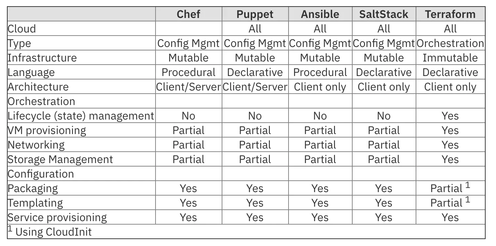

E como implementar uma Infraestrutura como Código?
--------------------------------------------------

Implementar um ambiente de Infraestrutura como Código depende de algumas ferramentas de automação, além de dispor de algumas ferramentas disponíveis para esta implementação. Alguns exemplos são as máquinas virtuais, ou VMs, que podem servir como um ambiente onde se define uma imagem e os softwares necessários para realizar o desenvolvimento.

Outro exemplo de implementação da Infraestrutura como Código é o Docker e os seus containers, que funcionam como a virtualização, porém num nível muito diferente. Oferecendo mais rapidez e agilidade na implantação das imagens, o Docker não necessita das grandes imagens e de grandes recursos de computação – e favorecem o ambiente para a adoção de novas arquiteturas, como os microsserviços.

Além destas ferramentas de virtualização, na administração de sistemas pode-se citar o diversas que permitem a execução de scripts para obter uma melhor orquestração de ações e operações entre todo um ambiente.

Ferramentas
-----------

As ferramentas de gerenciamento de configuração e automação do Server em geral podem ser usadas para alcançar a IaC. Há também soluções específicas para IaC. 

#### Estas são algumas escolhas bastante conhecidas:

*   Chef
*   Puppet
*   Ansible
*   Saltstack
*   Terraform 
*   AWS CloudFormation
*   Azure Resource Manager 
*   Google Cloud Deployment Manager
*   Crossplane
*   Vagrant
*   Pulumi

O Ansible Automation Platform pode ser usado para provisionar sistemas operacionais e dispositivos de rede, implantar aplicações e gerenciar configurações.

Qual a melhor ferramenta?
-------------------------

Escolher a ferramenta mais apropriada requer entendimento das muitas tarefas envolvidas no provisionamento de aplicativos e infraestrutura. As tarefas geralmente são divididas nos domínios de Configuration Management e Configuration orchestration. Vamos olhar para esses dois domínios para que possamos posicionar as diferentes ferramentas.

As ferramentas usadas para Configuration Management (CM) são ótimas para configuration nodes, mas não tão boas na coordenação de tarefas complexas. As ferramentas de Configuration orchestration tendem a deixar a configuração para ferramentas especializadas. Há sobreposição nessas funções e capacidades, e a maioria das ferramentas pode ser usada em ambas as funções. Na prática, algumas das ferramentas serão mais adequadas para determinados tipos de tarefas. A tabela a seguir compara as ferramentas de código aberto mais populares.

Configuration Management
------------------------

Geralmente, Ansible, Puppet, SaltStack e Chef são considerados ferramentas de gerenciamento de configuração (CM) e foram criadas para instalar e gerenciar software em instâncias de Server existentes (por exemplo, instalação de pacotes, inicialização de serviços, instalação de scripts ou arquivos de configuração no instância). Eles fazem o trabalho pesado de fazer com que uma ou mais instâncias desempenhem suas funções sem que o usuário precise especificar os comandos exatos. Nenhuma configuração manual ou scripts ad hoc são necessários.

Configuration orchestration
---------------------------

Ferramentas como o Terraform e CloudFormation são consideradas orquestradores. Eles são projetados para provisionar as próprias instâncias do Server, deixando o trabalho de configuração desses Serveres para outras ferramentas. A orquestração atende ao requisito de provisionar ambientes em um nível mais alto do que o gerenciamento de configuração. O foco aqui é coordenar a configuração em ambientes e clusters complexos.

[Introdução ao Ansible](https://www.redhat.com/pt-br/topics/automation/learning-ansible-tutorial "artigo | Introdução ao Ansible")

