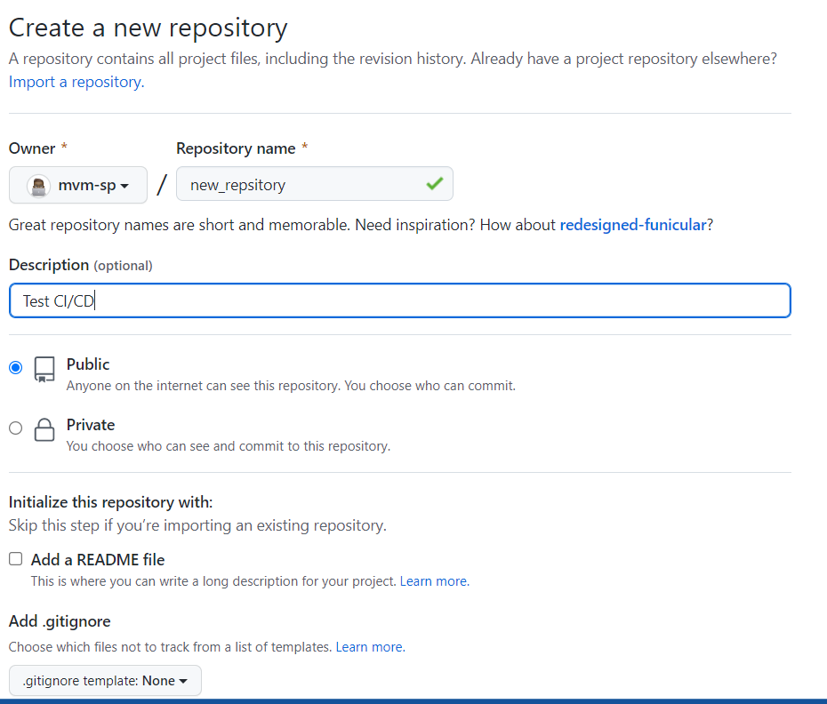
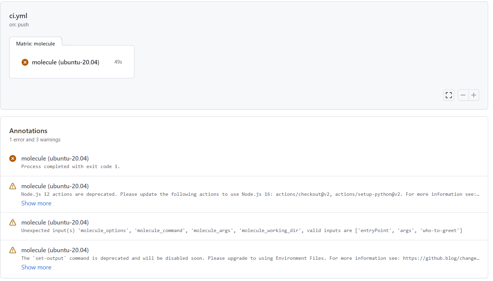

Criar a sua pipeline CI/CD com Git Actions
===========================================

Uma vez que você concluiu o [lab-01](01-lab.md) você deve ter a estrutura necessária para criar a sua pipeline no GitHub Actions, para isso você vai pecisar criar um repositório na sua conta do Github:


Preencha as informações necessárias finalizando a criação de seu novo repositório.



agora faça uma cópia deste repositório para a sua máquina local utilizando o comando `git clone`

```css
git clone [--template=<diretório-modelo>]
	  [-l] [-s] [--no-hardlinks] [-q] [-n] [--bare] [--mirror]
	  [-o <nome>] [-b <nome>] [-u <upload-pack>] [--reference <repositório>]
	  [--dissociate] [--separate-git-dir <dir git>]
	  [--depth <profundidade>] [--[no-]single-branch] [--no-tags]
	  [--recurse-submodules[=<pathspec>]] [--[no-]shallow-submodules]
	  [--[no-]remote-submodules] [--jobs <n>] [--sparse]
	  [--filter=<filter>] [--] <repositório>
	  [<diretório>]
```
Agora copie todo o conteúdo criado no [lab-01](01-lab.md) para a pasta de sua cópia do novo repositório, exemplo:

```css

cp lab/lab06/. github/posmack/meu-novo-projeto/. 

```

acesse o diretório local de seu novo repositório:

```css

cd github/posmack/meu-novo-projeto

```

crie uma nova estrutura de pastas para configurar sua pipeline, no `github` as pipelines do `Github Actions` devem estar na seguinte estrutura `.github/workflows`

```css

mkdir .github
mkdir .github/workflows

```
Nesta nova estrutura de pastas, crie um arquivo `YAML` podemos chama-lo de `ci.yml`:

```yaml
---
name: Molecule CI
on:
  push:
    branches:
      - 'main'

jobs:
  molecule:
    runs-on: ubuntu-latest
    strategy:
      fail-fast: false
      matrix:
        scenario: ubuntu-20.04
    steps:
      - name: Checkout
        uses: actions/checkout@v4
        with:
          path: "${{ github.repository }}"

      - name: Set up Python 3.
        uses: actions/setup-python@v2
        with:
          python-version: '3.x'

      - name: Install Ansible.
        run: pip3 install ansible          

      - name: Install molecule[docker].
        run: pip3 install molecule[docker]

      - name: Install yamllint.
        run: pip3 install yamllint

      - name: Install ansible-lint.
        run: pip3 install ansible-lint                     
 
      - name: Molecule
        uses: gofrolist/molecule-action@v2
        with:
          molecule_options: --debug --base-config ../../tests/molecule/base.yml
          molecule_command: test
          molecule_working_dir: ${{ github.repository }}
        env:
          PY_COLORS: '1'
          ANSIBLE_FORCE_COLOR: '1'"          
```

Faça o `push` de sua aplicação, sua pipeline já será disparada e, provavelmente, apresentará algum erro

Para verificar a execução, acesse o seu repositório do github e clique na opção `Actions`


Veja o resultado:



Como o seu repositório, provavelmente, é público alguns cuidados de segurança podem ser bem importantes, no meu caso, eu não fornecí as credenciais necessárias para a execução da tarefa:


Para corrigir o problema, seria necessário que estas informações estivessem presentes no momento da execução da pipe e existem formas seguras de fornecer informações sensíveis, mas a recomendação é que projetos que requeiram esta categoria de dado sejam privados, aumentando a sua segurança.

No nosso caso, vamos utiizar outra alternativa para termos sucesso na pipe,, verificando o erro, vemos que o probema está no arquivo `molecule/default/converge.yml`, vamos editar este arquivo para deixá-lo menos exigente:

```yaml
---
- name: Converge
  hosts: all
  gather_facts: false
  tasks:
    - ansible.builtin.debug:
        msg: "Fake ansible.builtin.import_playbook : ../../security-group.yml"

#- name: Include a play after another play
#  ansible.builtin.import_playbook: ../../security-group.yml
```

Comentamos a linha que executa o `playbook`, assim tudo será testado, mas nenhuma alteração será feita em nossas contas da `AWS`. 

Faça o `push` novamente e veja o que acontece


Agora você pode explorar mais recursos de sua `pipeline` como por exemplo, adicionar cenários para ela:

```yaml
---
name: Molecule CI
on:
  push:
    branches:
      - 'main'

jobs:
  molecule:
    runs-on: ubuntu-latest
    strategy:
      fail-fast: false
      matrix:
        scenario:
          - centos-8
          - debian-10
          - fedora-34
          - oraclelinux-8
          - ubuntu-20.04
    steps:
      - name: Checkout
        uses: actions/checkout@v2
        with:
          path: "${{ github.repository }}"

      - name: Set up Python 3.
        uses: actions/setup-python@v2
        with:
          python-version: '3.x'

      - name: Install Ansible.
        run: pip3 install ansible          

      - name: Install molecule[docker].
        run: pip3 install molecule[docker]

      - name: Install yamllint.
        run: pip3 install yamllint

      - name: Install ansible-lint.
        run: pip3 install ansible-lint                     

      - name: Molecule
        uses: gofrolist/molecule-action@v1
        with:
          molecule_options: --debug --base-config molecule/_shared/base.yml
          molecule_command: test
          molecule_args: --scenario-name ${{ matrix.scenario }}
          molecule_working_dir: "${{ github.repository }}"
        env:
          ANSIBLE_FORCE_COLOR: '1'
      - name: Run Molecule tests.
        run: molecule -verbose test
        env:
          PY_COLORS: '1'
          ANSIBLE_FORCE_COLOR: '1'
          MOLECULE_DISTRO: ${{ matrix.distro }}
        working-directory: "${{ github.repository }}"          
```

Faça outro `push` para verificar o resultado:


É isso! Agora é só continuar seus estudos no `Github Actions` ou em outra ferramenta que preferir.