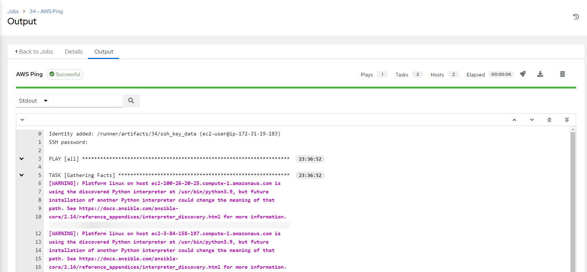

Configurando um Job Template
==========================================

Um `Job Template` é a própria definição de executar  Ansible playbooks. Portanto, para criar um novo modelo de trabalho ou executar o modelo de trabalho, precisamos adicionar o Ansible playbook de nosso `Projeto`, as `Credenciais` para autenticação, e as máquinas alvo que estão armazenadas nos `Inventários`.

Vá até o menu `Templates` a clique no botão `add`

Você verá que é aqui que tudo se encaixa, preencha os dados de seu template, perceba que este cadastro irá exigir dados que configuramos nos passos anteriores como o `Inventário` que será utilizado, o Projeto onde estão os playbooks, as `Credenciais` necessárias para a execução do projeto e qual é o `Playbook` que desejamos executar.

Depois de concluir o cadastro você poderá solicitar a execução de seu `template` clicando no ícone de execução (`Launch Template`)

Acompanhe a exeecução em sua lista de `jobs`

Caso tudo corra bem, você terá os detalhes da execução semelhante a este

>DICA: durante a execução de seu `job` é possível ver mais detalhes das `tasks` que fazem parte do `playbook`, faça um teste aumentando o nivel de `verbosity` de seu `template`

Agora você descobriu se seu inventário está acessível para execução de `playbooks` mais complexos