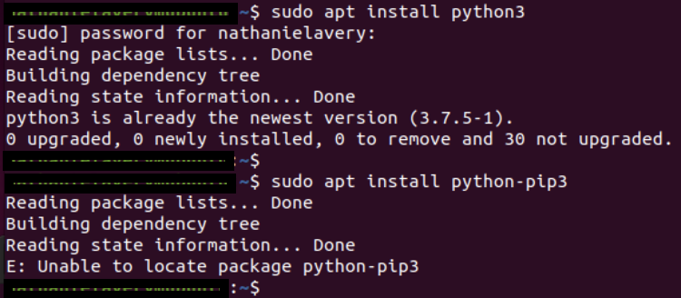

Instalando o Ansible + Python + Boto + Boto3 no Ubuntu
==========================================================================================================================================

A AWS, como outros provedores de serviços em nuvem (CSPs), oferece várias opções de gerenciamento. A maioria dos usuários começa com o console AWS GUI. É flexível e fornece acesso claro à maioria dos recursos que a plataforma oferece. A GUI é ótima, mas provavelmente melhor para tarefas usadas com pouca frequência e para se familiarizar com novos serviços. Usuários avançados tendem a superar a GUI para determinadas tarefas que precisam ser executadas com frequência ou repetidamente.

A automação de ações geralmente é melhor tratada na linha de comando. Aqui, a interface de linha de comando (CLI) da AWS ou ferramentas de terceiros, como Ansible e Terraform, podem ser usadas. Os comandos com script geralmente são muito amigáveis e facilmente consumíveis pelas ferramentas de Integração Contínua / Implantação Contínua (CI/CD). Existem várias dessas ferramentas, como Jenkins, GitLab e até os próprios aplicativos CodePipeline da AWS, entre outros.

Para usar o Ansible com AWS, alguns aplicativos complementares precisam ser instalados junto com ele.

Ansible é escrito na linguagem de programação Python. Por causa disso, o Python e as ferramentas de suporte precisam ser instalados. A documentação do Ansible diz que os seguintes pacotes são necessários: Python versão 2.6 ou superior e Boto. Boto é o AWS Software Development Kit (SDK) para python. Este guia opta por usar as versões mais recentes desses pacotes. Especificamente, a versão 3.x. O Pip (Package Installer for Python) também é instalado e é usado para trazer o próprio Ansible.

**Passo a passo para um iniciante instalar o Ansible na AWS**
--------------------------------------------------------------

1.  Ansible é uma ferramenta de automação de TI que automatiza a configuração, implantação e gerenciamento de aplicações. Ansible usa um conjunto de tarefas chamadas de playbooks para automatizar tarefas em seus servidores.
2.  Para instalar o Ansible, você precisará de um servidor Ansible controlador e de vários servidores de destino. O servidor Ansible controlador pode ser executado em qualquer plataforma, incluindo Linux, MacOS ou Windows. O servidor de destino deve ser um sistema Linux.
3.  Os servidores Ansible controlador e de destino devem estar configurados para se comunicarem usando SSH. Você precisará gerar uma chave SSH para cada servidor e adicioná-la ao arquivo de chaves do servidor Ansible controlador.
4.  O Ansible controlador deve ter o Python 2.7 ou superior instalado. Se o Ansible controlador estiver executando o MacOS, você poderá instalar o Python usando o Homebrew.
5.  O Ansible controlador deve ter o pip instalado. O pip é um sistema de gerenciamento de pacotes padrão de facto usados para instalar e gerenciar pacotes de software escritos em Python. Você pode instalar o pip usando o Homebrew se estiver no MacOS.
6.  O Ansible controlador deve ter o Ansible instalado. Você pode instalar o Ansible usando o pip.
7.  O Ansible controlador deve ter o boto3 instalado. O AWS SDK for Python (Boto3) fornece uma API Python para serviços de infraestrutura da AWS. Você pode instalar o boto3 usando o pip.
8.  O Ansible controlador deve ter o AWS CLI (Command Line Interface) instalado. Você pode instalar o AWS CLI usando o pip.
9.  O Ansible controlador deve ter o módulo Ansible AWS instalado. Você pode instalar o módulo Ansible AWS usando o pip.
10.  O Ansible controlador deve ter o módulo Ansible boto3 instalado. Você pode instalar o módulo Ansible boto3 usando o pip.

**Requisitos:**

* Python3
    
* Pip3
    
* Boto + Boto3

* Ansible
    

Instale Python3 e Python-Pip3. Pip3 será chamado na próxima etapa para instalar Boto, Boto3 e Ansible.

```console

$ sudo apt update

$ sudo apt upgrade

$ sudo apt install python3

$ sudo apt install python-pip3

```




Instale Boto, Boto3 e Ansible. A instalação é realizada por meio de uma linha.

```console

$ pip3 install boto boto3 ansible

```


Verifique se o Ansible está instalado e pode ser chamado.

```console

$ ansible —versão

```


Neste ponto, o Ansible deve estar pronto para uso.