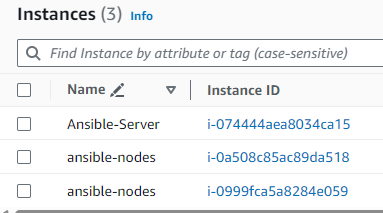

Configurando o seu inventario (hosts/groups)
==========================================================================================================================================


Automatiza tarefas em nós geridos ou `hosts` na sua infra-estrutura, utilizando uma lista ou grupo de listas conhecidas como inventário. Pode passar nomes de `hosts` na linha de comando, mas a maioria dos utilizadores Ansible cria diretórios de inventário. O seu inventário define os nós geridos que automatiza, com `groups` para que possa executar tarefas de automatização em múltiplos `hosts` ao mesmo tempo. Uma vez definido o seu inventário, utiliza [patterns](https://docs.ansible.com/ansible/latest/inventory_guide/intro_patterns.html#intro-patterns) para seleccionar os `hosts` ou `groups` contra os quais quer que o Ansible seja executado.

**Como podemos construir nosso inventário**
--------------------------------------------------------------
O inventário mais simples é um único diretório com uma lista de `hosts` e `groups`. A localização padrão para este diretório é `/etc/ansible/hosts`. Pode especificar um diretório de inventário diferente na linha de comando utilizando a opção `-i <caminho>` ou na configuração utilizando `inventory`.

[Plugins de inventário](https://docs.ansible.com/ansible/latest/plugins/inventory.html#inventory-plugins) suportam uma gama de formatos e fontes para tornar o seu inventário flexível e personalizável. À medida que o seu inventário se expande, poderá precisar de mais do que um único diretório para organizar os seus `hosts` e `groups`. Aqui estão três opções para além do diretório `/etc/ansible/hosts`: - Pode criar um diretório com múltiplos diretórios de inventário. Ver [Organizar inventário num diretório](https://docs.ansible.com/ansible/latest/inventory_guide/intro_inventory.html#inventory-directory). Estes podem utilizar formatos diferentes (YAML, ini, e assim por diante). - Pode puxar o inventário de forma dinâmica. Por exemplo, pode usar um plugin de inventário dinâmico para listar recursos em um ou mais fornecedores de nuvem. Ver [Trabalhar com inventário dinâmico](https://docs.ansible.com/ansible/latest/inventory_guide/intro_dynamic_inventory.html#intro-dynamic-inventory). - Pode utilizar múltiplas fontes para inventário, incluindo tanto o inventário dinâmico como os diretórios estáticos. Ver [Aprovação de múltiplas fontes de inventário](#utilização de múltiplas fontes de inventário).

**Configurando o seu host com o arquivo de `hosts` e autenticação por chaves assimétricas**
--------------------------------------------------------------------------------------------

A seguir faremos um passo a passo para construirmos nosso inventário via arquivo de `hosts` do `ansible` habilitando a comunicação entre os servidores utilizando troca de chaves assimétricas.

Para nosso exemplo, precisaremos configurar um console do `ansible` e 2 servidores que farão parte de nosso inventário em `/etc/ansible/hosts`. Faça a configuração de ser console do ansible utilizando as referências deste repositótio [Instalação](00-install.md0) ou [instância de Ubuntu/Ansible](01-ubuntu-boto3.md)

Em seguida, crie 2 instâncias independentes para que nosso console do `ansible` possa interagir. No nosso caso utilizarei instâncias `CentoOS` para montar este cenário, mas você pode utilizar a distribuição que mais se sinta mais confortável, porém algumas sintaxes utilizadas neste estudo podem necessitar de customizações para que possamos concluí-lo com sucesso

Para que todas instâncias sejam acessadas a partir de minha máquina local, foram necessárias algumas configurações no momento da criação de cada uma delas.

### Security Group

Configuramos todas as instâncias com acesso via `ssh` e possibilidade de verificação de disponibilidade via `ping`:


Caso suas instâncias não possuam estas regras de acesso liberadas, algumas ou todos os passos desse estudo não serão executados com sucesso.

### Chaves de Acesso (Key Pair)

Certifique-se de criar todas as instâncias com a mesma chave de acesso, isso não é obrigatório e pode ser que em ambientes produtivos não seja recomendado, mas facilitará nosso estudo e a execução dos passos a seguir:


Você deve salvar a chave em um diretório local e garantir que suas chaves estejam seguras utilizando o comando de alteração de permissões do linux:

```console

chmod 400 ansible.pem

```


**Passo 1 - Obtendo os endereços `IPs`**
-----------------------------------------

Utilizando a estrutura da AWS, temos nosso 3 servidores configurados:



