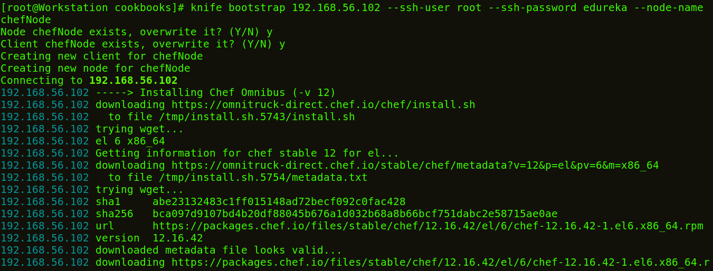

**Etapa 9:**  Adicionar Chef Node ao Chef Server.

Para fins de demonstração, usarei uma máquina CentOS como Chef Node. Pode haver centenas de **_Nodes_** conectados a um Chef Server. A cor do terminal da minha máquina Node é diferente da Workstations para que você possa diferenciar entre ambos.

Eu só preciso do endereço IP do meu Node para isso vou executar o comando abaixo na minha máquina Node.

**Executar****u****t****e** **t****h****é:**

1

`ifconfig`

Adicionarei meu Chef Node ao Server executando o comando Knife Bootstrap no qual especificarei o endereço IP do The Chef Node e seu nome. Execute o comando mostrado abaixo:

** Executar **** t **** é: **

1

`knife bootstrap` `192.168.56.102` `--ssh-root do usuário` `--ssh-password edureka -- ``**_node_**-name chefNode`

Este comando também inicializará a instalação do Chef-Client no Chef Node. Você pode verificá-lo na CLI na Workstations usando o comando faca, conforme mostrado abaixo:

** Executar **** t **** é: **

1

`knife` `**_node_** list`

Você também pode verificar no Chef Server. Vá para a guia **_Nodes_** no console de gerenciamento do Server, aqui você notará que o **_Node_** que você adicionou está presente. Consulte a captura de tela abaixo.

_fonte_: _https://www.edureka.co/blog/chef-tutorial/_

[Passo 10](10-steps.md)